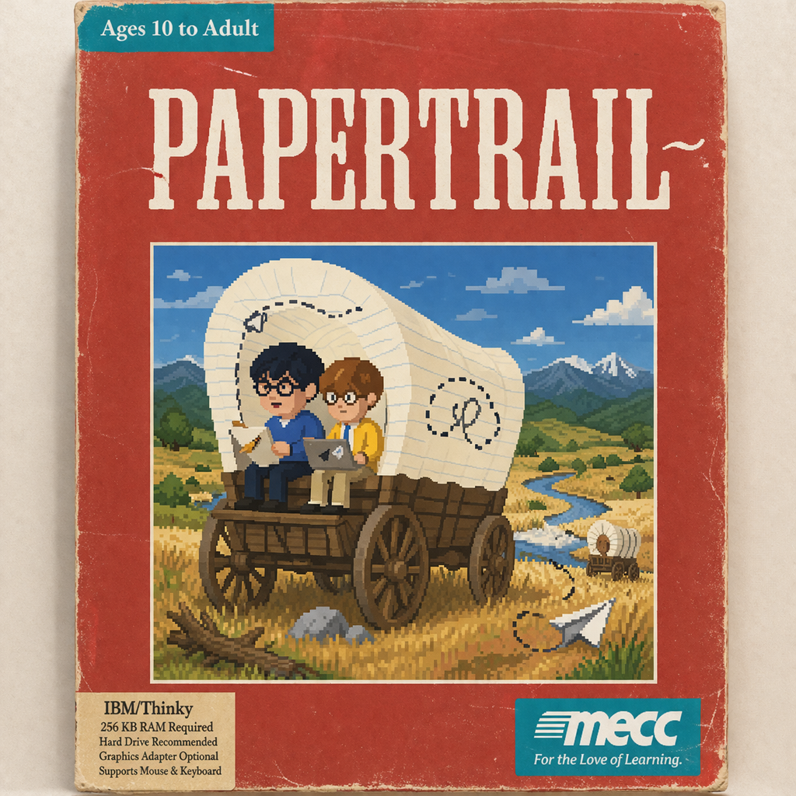

<p align="center">
  
</p>

<p align="center">
  <strong>A desktop app that turns Claude into a team of AI employees.</strong><br/>
  Hire agents. Give them roles. Watch them code, browse, message, and run scheduled work from a living pixel office on your desktop.
</p>

<p align="center">
  
</p>

## What it is

PaperTrail is a desktop environment for coordinating multiple Claude-powered agents with shared workspace context, local tool access, browser automation, messaging, and scheduled workflows.

This repo is the **Windows-forward port** of PaperTrail. The app started macOS-first, but the current work is about making it genuinely usable on Windows instead of merely "technically buildable."

## Platform status

- **Windows:** active port, ready for limited beta testing
- **macOS:** original target platform
- **Linux:** packaging target exists, not yet treated as a primary platform

When older docs or screenshots disagree, treat the Windows notes in this repo as the source of truth.

## How it works

1. **Hire agents** with names, roles, personalities, and models
2. **Describe a goal** in plain English
3. **Let the orchestrator split the work** across the right agents
4. **Watch them do it** in the office while using real tools
5. **Ship the result** without babysitting every step

## What agents can do

- **Write and ship code** across multiple repos
- **Browse the web** for research, screenshots, and form-filling
- **Send messages** through supported channels
- **Run on schedules** with cron, intervals, and one-off triggers
- **Query databases** through MCP-backed tools
- **Manage project workflows** like issues, tickets, and summaries
- **Extend through MCP** so internal tools and APIs become part of the office

## Core features

- **Pixel Office** powered by Phaser
- **Multi-agent orchestration** with shared context
- **Claude Code integration** with persistent sessions
- **Built-in browser** for real web interaction
- **Triggers and scheduling** for background automation
- **SQLite storage** for local persistence
- **Permission gates** for sensitive actions
- **Built-in Git and file browser** for workspace visibility
- **Background mode and notifications** so work keeps moving

## Windows notes

### What already looks good
- Electron shell and renderer architecture
- Windows process spawning and cleanup
- Claude CLI discovery on Windows
- `better-sqlite3` rebuild path for packaging
- Windows icon / NSIS packaging configuration
- Platform gating for macOS-only features like iMessage

### What to expect in beta
- Windows is still **beta**, not GA
- Some older app copy and docs may still reflect the macOS origin
- Code signing is not configured yet, so SmartScreen warnings are expected
- Real Windows smoke testing matters more than static optimism

### Platform-specific reality
- **iMessage is macOS-only** and disabled on Windows
- Windows shell execution uses Windows-native handling where needed
- Native module builds may require Visual Studio Build Tools on some systems

## Build from source

### Prerequisites
- Node.js installed
- Claude Code installed and authenticated
- For Windows builds, Visual Studio Build Tools may be required for native modules

### Development

```bash
git clone https://github.com/StellarSk8board/papertrail.git
cd papertrail
npm install
npm run electron:dev
```

### Packaging

```bash
npm run electron:build
```

Windows packaging targets NSIS. macOS and Linux packaging targets remain in the build config.

## Scripts

| Command | Description |
| --- | --- |
| `npm run dev` | Start Vite dev server (renderer only) |
| `npm run electron:dev` | Build and launch the Electron app in dev mode |
| `npm run electron:build` | Package distributables |
| `npm run generate-ico` | Regenerate the Windows `.ico` from the PNG source |

## Tech stack

| Layer | Technology |
| --- | --- |
| Desktop | Electron |
| Frontend | React 19 + TypeScript + Tailwind CSS |
| Build | Vite |
| Graphics | Phaser 3 |
| Storage | SQLite (`better-sqlite3`) |
| AI | Claude Code SDK |

## Positioning

PaperTrail is not trying to be a generic chat wrapper. It is a desktop environment for coordinating multiple Claude-powered agents with visible presence, shared workspace context, tool access, and automation workflows.

The Windows port goal is simple: keep what makes the app fun, remove the macOS assumptions that break it, and make it stable enough to be worth using on Windows for real.
